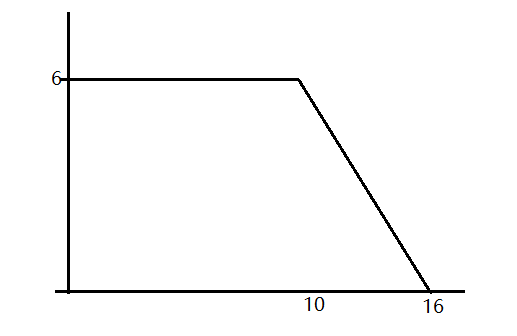

# 关于分工
## 目前认为的功能分开的模块
- pawn策略，寻路策略，战力分析策略
- 攻击模块：在不考虑移动情况下的攻击策略，（attack 距离为1的哪个  creep，已经较为完善）
- 预测系统 [predictSys](predictSys.ts) （在设计中，记录每个预测case，包括伤害的时间大小，击杀之间的关系）
# 标准战术
## 开局出一个3C5MW 的运营creep
理由：按照计算，大部分情况运营爬能在野container，抢先造出一个ram，就算对方开局出了一个5MA，可以先逃跑，等自己的5MA或者主力到了再去运营。
## 之后大部分出 10M6A 的主力近战爬
### 计算体型
|体型|价格|速度|战力|
|:-  |:- |:-  |:-|
|10M6A|980|沼泽3tick|78|
|12M5A|1000|沼泽3tick|72.5|
|13M4A|970|沼泽2tick|60|
|8M7A|960|沼泽5tick|80.5|
由此可见，10M6A为计算下来战力最强的坦克creep
### 计算速度
假设creep经过的1/3的路都是沼泽（在中场时或许可以认为是1/2?)。

那么总时间=2*平地时间+1*沼泽时间。那么沼泽3tick=总5tick。沼泽5yick=总7tick。10M6A战力和8M7A差不多，但速度大为提升。所以主力应该选用10M6A。
### 搭配
每2~3个主力爬，配一个5MH 的治疗爬。

对方治疗不足，则出5M1R 的骚扰爬。

对方出非满速R 则出 (5MA / 10M2A) 和5MH，或者出慢速的R和慢速的H（编码上较容易控制，但不推荐，因为会被对方的满速A反推）。
## 关于为什么不出远程R
当速度为标准，也就是沼泽3tick 时。

2MR 价格=250 伤害=10   单位价格的伤害=0.04

2MH 价格=350 治疗量=12 单位价格的治疗=0.034

delta HP=H的治疗*总时间-R的伤害*战斗时间

当HP不变时，战斗时间/总时间=H的治疗/R的伤害=0.85

也就是说治疗只要有15%的时间脱战就能抵抗R的伤害。稍微带一点5MA 逼退对方的远程R后再折返，如此反复，对方就造成不了伤害。
## 关于主力和治疗的比例
按照红球有多长时间的脱战，以及战斗后能否存活计算
## 战力的计算
红球对A时 ATTACK 提供的生命值只能算一半

例：一个10M6A的Creep的战力图

|提供的输出\\损失的生命值|0|1|2|3|4|5|6|7|8|9|10|11|12|13|14|15|16|
|:-|:-|:-|:-|:-|:-|:-|:-|:-|:-|:-|:-|:-|:-|:-|:-|:-|:-|
|6|-|-|-|-|-|-|-|-|-|-|-||||||||
|5|||||||||||| \\ ||||||
|4||||||||||||| \\ |||||
|3|||||||||||||| \\ ||||
|2||||||||||||||| \\ |||
|1|||||||||||||||| \\ ||
|0||||||||||||||||| \\ |

当MOVE部件全部毁坏的时候，攻击会逐渐降低。此时认为该Creep提供的总输出=10*6+(6*6/2)=78。

也就是说，战力=dps*(其他部件提供的hp+0.5*攻击部件提供的hp)

# 有什么想说的可以补充在这里
> masterkeze 20221115
> ## 防守反击
> ### 战术思路：
> container和ram开局 + 反rush + 野区控制 + 地堡推进
> #### 开局
> 2c2m + 2w2c
> 建 ram * 5, container * 1, road * 4
> 2c2m在运输完开局的三个container之后，转到野区采集
> 2w2c 按照建造>填充spawn>填充container优先级工作，在修建工作完成、拖车搭档出生之后，转到野区采集
>
> #### 反rush
> 等rush部队接近时(<30tick)根据rush部队的组成出对策爬
> 1. 有红球
> 出足够多的attack部件防止强拆，在此基础上尽量保持平地上满速，满足不了就保证在路上满速
> 2. 纯蓝绿球
> 出能破防的蓝球，不让对方白嫖基地，如果对方总dps较低，甚至可以不理
>
> 后续进程
> 1. rush部队强拆
>   根据对方战损情况，追加蓝球进行收割、追击
> 2. rush部队僵持/用蓝球慢慢蹭
>   根据情况出蓝球，防止白嫖/减少对方攻击频率
> 3. 地堡战力分析：
>
>     Power(4ra4m) = 1.33*(4+0.5*4) = 8
>
>     Power(4ra4m+ram) = 1.33*(204+0.5*4) = 274 提升了3325%
>
>     Power(10m6a) = 6*(10+0.5*6) = 78
>
>     Power(10m6a+ram) = 6*(210+0.5*6) = 1065 提升了1265%
>
>     Power(10m6a * 5) = 4*78 + 6*96 = 888
>
>     Power(10m6a * 6) = 5*78 + 10*96 = 1350 （所有红球一起参战的极限Power）
>
>     用红球+地堡强防守，可以做到1防5 or 1防6，经济实惠。体型设计上。
