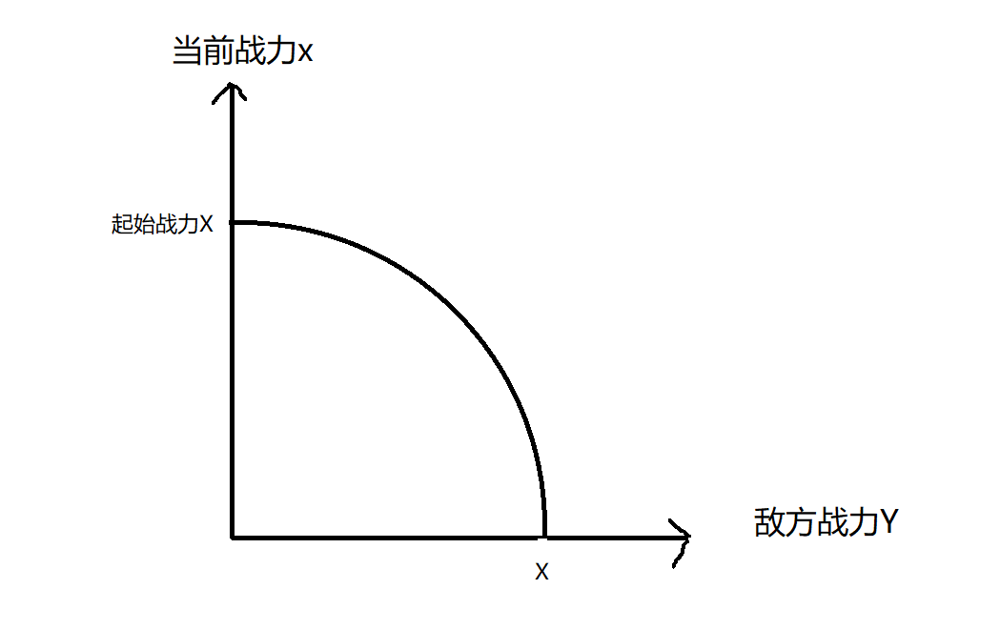

## 战力模拟计算

假设A队战力为$X$，B队战力为$Y$，$X>0,Y>0$

且 $X>Y$ ,则A和B交火后，B队全灭，A的剩余量为$Z$

设A当前战力为$x$，B当前战力为$y$，时间为$t$ , $x>0,y>0,t>0$

设战力随时间的变化量为对方战力的相反数

$$  \begin{cases}
	{dx \over dt} = -y \\
 	{dy \over dt} = -x
	\end {cases}  $$

则

$$ {d^2x \over dt^2}=x $$

$$ x''-x = 0 $$

根据微分方程的通解

$$ r_1=1,r_2=-1 $$

$$ x=C_1e^t+C_2e^{-t} $$

A的当前战力$x$的表达式得出，接下来算当$y$为0 时的$x$的值，已计算出A队战斗后的剩余量 $Z$

当 $t=0$ 时，$x= C_1+C_2=X$

$$ y= -{dx \over dt} ={-C_1e^t+C_2e^{-t}} $$

算出$Y$的表达式后，计算$C_1,C_2$和$X,Y$的关系

当 $t=0$ 时，$y=-C_1+C_2=Y$

$$  \begin{cases}
	C_1 = {{X-Y}\over 2} \\
 	C_2 = {{X+Y}\over 2}
	\end {cases}  $$

当$y=0$时

$$  \begin{cases}
	x=C_1e^t+C_2e^{-t} \\
 	y= 0 ={-C_1e^t+C_2e^{-t}}
	\end {cases}  $$

$$ C_1e^t=C_2e^{-t} $$

$$ e^t=\sqrt {C_2 \over C_1} $$

$$ e^{-t}=\sqrt {C_1 \over C_2} $$

$$ x=C_1\sqrt {C_2 \over C_1}+C_2\sqrt {C_1 \over C_2}=2\sqrt{C_1C_2}$$

将$X,Y$代回$C_1,C_2$

$$x=2\sqrt{{X^2-Y^2}\over 4}=\sqrt{X^2-Y^2}$$

所以发生战斗后A队的剩余量为

$$Z=\sqrt{X^2-Y^2}$$

画出图形后为四分之一个圆弧，当$Y=0$时，A队剩余量为初始战力。

当$Y=X$，也就是双方战力相同时，剩余量为 0。当 $ Y<X $ 时剩余量呈现圆弧。

